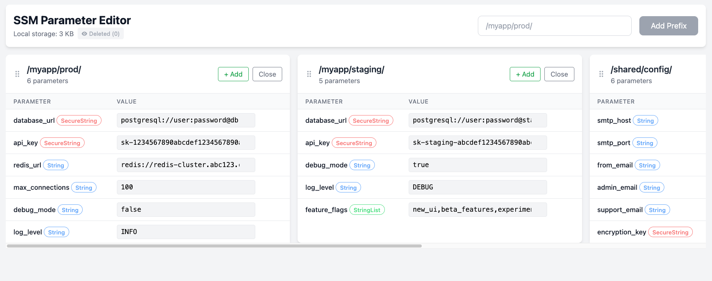

# SSM Parameter Editor UI

A web-based interface for managing AWS Systems Manager Parameter Store variables with an intuitive UI for creating, updating, and deleting parameters.



## Inspiration

This tool is heavily inspired by [Clasyc/ssm-env](https://github.com/Clasyc/ssm-env) - a fantastic CLI tool for handling AWS Systems Manager Parameter Store variables. We've adapted its core functionality to create a web-based interface.

## Requirements

- `PHP 8.3 + Composer` or `Docker`
- AWS credentials

## Setup

### Docker

Build and run the container with your AWS credentials:

```bash
docker build -t ssm-env .
docker run -p 8080:80 \
  -e AWS_ACCESS_KEY_ID=your_access_key \
  -e AWS_SECRET_ACCESS_KEY=your_secret_key \
  -e AWS_DEFAULT_REGION=us-east-1 \
  ssm-env
```

The application will be available at `http://localhost:8080`

### Local development server

1. **Install dependencies:**
   ```bash
   composer install
   ```

2. **Start the development server:**

   **Option A: Built-in PHP server:**
   ```bash
   cd api
   php -S localhost:8080
   ```

   **Option B: Laravel Valet (recommended for macOS):**
   ```bash
   # Install Valet if not already installed
   composer global require laravel/valet
   valet install

   # Link the project directory
   valet link ssm-env

   # Your API will be available at http://ssm-env.test/api/
   ```

   **Option C: Other local development tools:**
   - XAMPP, MAMP, or similar with document root pointing to project directory
   - Any other local web server setup

3. **Test the setup:**
   ```bash
   curl "http://ssm-env.test/api/test.php"
   ```

#### Authentication

Configure AWS credentials using one of these methods:

- **Environment variables:**
  ```bash
  export AWS_ACCESS_KEY_ID=your_access_key
  export AWS_SECRET_ACCESS_KEY=your_secret_key
  export AWS_DEFAULT_REGION=us-east-1
  ```

- **AWS credentials file:**
  ```bash
  # Create ~/.aws/credentials file
  [default]
  aws_access_key_id = your_access_key
  aws_secret_access_key = your_secret_key
  region = us-east-1
  ```

## API Endpoints

### GET /test.php
Health check endpoint to verify the backend is working.

**Example:**
```bash
curl "http://localhost:8080/api/test.php"
```

### GET /getParameters.php
Fetch parameters by prefix.

**Query Parameters:**
- `prefix` (required): SSM parameter prefix

**Example:**
```bash
curl "http://localhost:8080/api/getParameters.php?prefix=/myapp/prod/"
```

### POST /createParameter.php
Create a new parameter.

**Request Body:**
```json
{
  "prefix": "/myapp/prod/",
  "name": "database_url",
  "value": "mysql://localhost:3306/mydb",
  "type": "String"
}
```

**Example:**
```bash
curl -X POST http://localhost:8080/api/createParameter.php \
  -H "Content-Type: application/json" \
  -d '{"prefix":"/myapp/prod/","name":"test","value":"hello","type":"String"}'
```

### PUT /updateParameter.php
Update an existing parameter.

**Request Body:**
```json
{
  "fullName": "/myapp/prod/database_url",
  "value": "mysql://localhost:3306/newdb",
  "type": "String"
}
```

**Example:**
```bash
curl -X PUT http://localhost:8080/api/updateParameter.php \
  -H "Content-Type: application/json" \
  -d '{"fullName":"/myapp/prod/test","value":"updated","type":"String"}'
```

### DELETE /deleteParameter.php
Delete an existing parameter.

**Request Body:**
```json
{
  "fullName": "/myapp/prod/database_url"
}
```

**Example:**
```bash
curl -X DELETE http://localhost:8080/api/deleteParameter.php \
  -H "Content-Type: application/json" \
  -d '{"fullName":"/myapp/prod/test"}'
```

## Parameter Types

- `String`: Plain text value
- `StringList`: Comma-separated list of values
- `SecureString`: Encrypted value using AWS KMS

## Error Handling

All endpoints return JSON responses with error messages:

```json
{
  "error": "Error message here"
}
```

HTTP status codes:
- `200`: Success
- `400`: Bad request (missing fields, invalid JSON)
- `405`: Method not allowed
- `409`: Conflict (parameter already exists)
- `500`: Server error (AWS errors, etc.)
